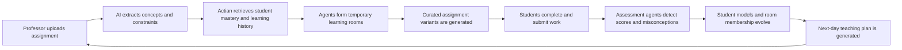
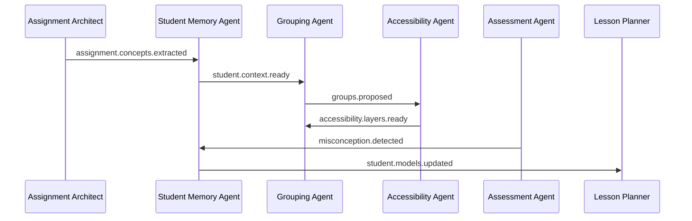
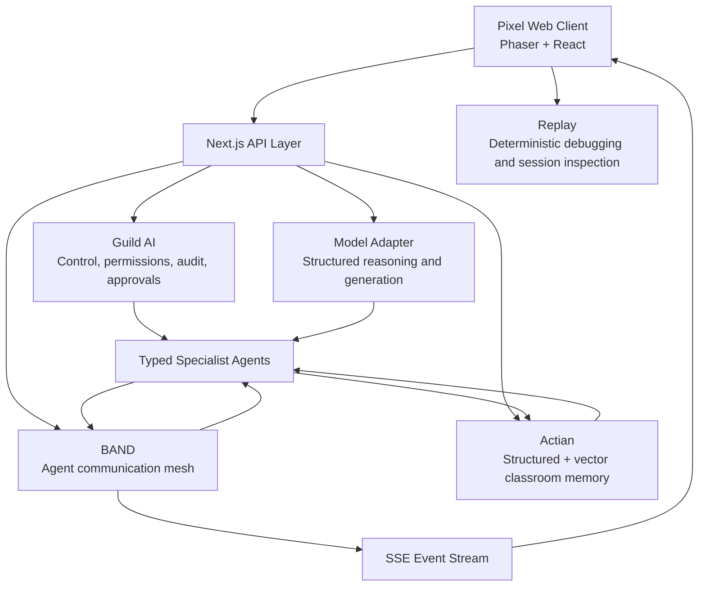

# EduForge

**A self-evolving classroom that rebuilds itself around how students learn.**

EduForge is an agentic education platform that turns one professor-uploaded assignment into multiple evidence-based learning pathways. It studies previous student performance, identifies the concepts each student is struggling with, forms temporary learning rooms, adapts assignments without lowering academic rigor, grades the results, updates mastery profiles, and creates a next-day teaching plan for the professor and TA.

Instead of another static analytics dashboard, EduForge presents the entire workflow as a living pixel school. Agents move through the world, rooms are built around learning gaps, students move between rooms as their understanding changes, and the school visibly evolves after every assignment.

---

## Table of Contents

- [The Problem](#the-problem)
- [How It Works](#how-it-works)
- [The Living Pixel School](#the-living-pixel-school)
- [Core Agent System](#core-agent-system)
- [Sponsor Integrations](#sponsor-integrations)
  - [Guild AI](#guild-ai--the-control-plane-behind-the-school)
  - [Actian](#actian--the-long-term-memory-of-the-classroom)
  - [BAND](#band--the-communication-mesh-for-ai-agents)
  - [Replay](#replay--reliability-for-a-complex-live-demo)
- [Architecture](#architecture)
- [Demo Flow](#demo-flow)
- [Responsible Personalization](#responsible-personalization)
- [Tech Stack](#tech-stack)
- [Local Development](#local-development)
- [Key API Routes](#key-api-routes)
- [Why EduForge](#why-eduforge)

---

## The Problem

A professor may teach one class, but that class contains many different learning histories.

Some students struggle with integer operations. Others understand the concepts but apply them in the wrong order. Some need accessibility supports such as chunked instructions, predictable sequencing, reduced visual overload, or extended time. Others are ready for advanced work.

Teachers know this, but creating, tracking, grading, and planning around every learning need is nearly impossible at classroom scale.

**EduForge closes that loop.**

---

## How It Works



The current demo uses a synthetic Algebra I class and focuses on:

- Integer operations
- Distributive property
- Equation sequencing
- Combining like terms

Students are grouped by their current academic barrier, **never** by diagnosis or accommodation label.

Accessibility remains a delivery layer that changes presentation, pacing, sequencing, and support while preserving the original learning objective.

---

## The Living Pixel School

EduForge makes the architecture visible through an isometric pixel environment.

| Location | Purpose |
|---|---|
| **Professor Tower** | Upload assignments and define teaching intent |
| **Memory Library** | Actian-powered student and classroom memory |
| **Agent Workshop** | Guild AI-controlled specialist agents |
| **Communication Beacon** | BAND-powered agent communication |
| **Ember Room** | Integer-operation intervention |
| **Forge Room** | Distributive-property intervention |
| **Harbor Room** | Equation-sequencing support |
| **Summit Room** | Extension work for high-mastery students |
| **Assessment Forge** | Grading and misconception detection |
| **Planning Observatory** | Next-day teaching-plan generation |

Every backend event produces a visible change in the world. Rooms rise when groups are formed, students move after mastery updates, misconception symbols emerge from the Assessment Forge, and a translucent "tomorrow world" appears when the next lesson plan is ready.

---

## Core Agent System

EduForge uses specialized agents instead of one oversized prompt.

### Assignment Architect
Understands the uploaded assignment, extracts learning objectives, maps questions to concepts, estimates difficulty, and preserves professor constraints.

### Student Memory Agent
Retrieves concept-specific mastery, recent misconceptions, documented supports, and successful scaffolds from Actian.

### Grouping Agent
Creates three or four explainable learning rooms based on concept gaps, misconception similarity, mastery bands, and support compatibility.

### Accessibility Agent
Adds student-level delivery supports without changing documented accommodations or lowering academic expectations.

### Assignment Curator
Creates one room-level assignment variant plus student-level presentation overlays, with explicit objective-preservation and rigor checks.

### Assessment Agent
Grades prepared submissions, classifies misconceptions, assigns confidence, and routes low-confidence work to professor review.

### Classroom Evolution Agent
Updates mastery estimates, misconception confidence, scaffolding levels, and recommended room membership.

### Lesson Planner
Turns the updated classroom state into an evidence-backed next-day lesson timeline for the professor and TA.

---

## Sponsor Integrations

### Guild AI — The Control Plane Behind the School

Guild AI is what turns EduForge from a collection of prompts into a controlled, inspectable agent system.

Every specialist agent is registered through the Guild layer with a defined purpose, permission boundary, workflow run, and audit history. Guild tracks which agent read student context, which agent proposed a learning room, which agent created an assignment variant, and which decisions require human approval.

In EduForge, Guild AI powers:

- Agent registry and identity
- Per-agent permissions
- Workflow run IDs
- Human approval gates
- Low-confidence grading review
- Final lesson-plan approval
- Agent audit logs
- Evidence-linked decision history
- Safe separation between read, write, and approval actions

This is especially important in education, where an AI system should never silently change documented supports, publish uncertain grades, or make high-impact decisions without educator oversight.

Guild AI gives EduForge the governance layer required for trustworthy classroom automation.

### Actian — The Long-Term Memory of the Classroom

Actian is not used as a basic grade table. It acts as EduForge's **Classroom Memory Engine**.

The platform stores both structured records and semantic learning observations:

**Structured memory**
- Student mastery by concept
- Assignment scores
- Documented supports
- Scaffolding levels
- Room history
- Lesson-plan history

**Semantic memory**
- Repeated misconception patterns
- Successful interventions
- Student-specific learning observations
- Assignment and concept embeddings
- Evidence explaining why a group was formed

When a new assignment is uploaded, EduForge does not load every fact about every student. The Student Memory Agent asks Actian for the learning history most relevant to the concepts in that assignment.

For example:

> Maya performs well with a visual number line but repeats sign errors when the support is removed.

That observation can be retrieved when integer operations appear again, allowing the system to apply the right scaffold, measure whether it worked, and gradually reduce support as mastery improves.

Actian makes the classroom genuinely self-evolving because every assignment contributes to persistent, reusable learning memory.

### BAND — The Communication Mesh for AI Agents

EduForge is not a rigid sequence of disconnected functions. Its agents communicate through an event-driven mesh powered by BAND.

Each agent publishes structured events and responds only to the topics relevant to its role.



BAND enables:

- Real-time agent-to-agent communication
- Topic-based event routing
- Request and response flows
- Shared run context
- Agent handoffs
- Communication history for the UI
- Human-agent coordination
- A visible event stream judges can watch in real time

In the pixel world, BAND messages appear as glowing particles moving between buildings and as structured messages in the agent feed.

The communication layer is not hidden infrastructure. It is part of the product experience.

### Replay — Reliability for a Complex Live Demo

EduForge has a difficult frontend: Phaser animations, React panels, SSE events, world-state transitions, timed choreography, assignment morphing, and student movement all need to remain synchronized.

Replay gives the team a deterministic way to inspect exactly what happened when something goes wrong.

Replay is used to debug:

- SSE timing problems
- Missed or duplicated agent events
- React and Phaser state mismatches
- Students moving before rooms finish building
- Blank or partially rendered canvas states
- Assignment morph panel regressions
- Mobile layout problems
- Flaky Playwright interactions
- Demo-only bugs that are difficult to reproduce manually

Replay also gives EduForge a future product use case: educators could revisit how a run unfolded, inspect which agent formed a room, understand why a student was moved, and review the evidence behind a generated teaching plan.

For a system built around visible, time-based agent behavior, Replay is not just a debugging add-on. It is the reliability layer that makes the entire experience demo-safe and explainable.

---

## Architecture



---

## Demo Flow

1. The professor uploads a multi-step equations assignment.
2. The Assignment Architect extracts the concepts.
3. The Memory Library retrieves relevant student history from Actian.
4. Guild-authorized agents begin a new workflow run.
5. BAND carries messages between the specialist agents.
6. Ember, Forge, Harbor, and Summit rooms are built.
7. Students move into rooms based on their current learning barriers.
8. The professor compares the original assignment, room version, and student accessibility layer.
9. Prepared submissions are simulated.
10. The Assessment Agent finds scores, misconceptions, and low-confidence work.
11. Student mastery updates and room membership changes.
12. The Planning Observatory generates tomorrow's lesson plan with evidence links.

> Every assignment teaches the student. Every submission rebuilds the school.

---

## Responsible Personalization

EduForge follows several strict design rules:

- Students are grouped by learning need, not disability label.
- A diagnosis does not determine a fixed assignment format.
- Accessibility changes delivery, not academic expectations.
- Documented supports are never changed automatically.
- Low-confidence grades require professor review.
- Every grouping and adaptation includes evidence.
- Final grades and teaching plans remain educator-controlled.
- The demo uses synthetic student data only.

---

## Tech Stack

- Next.js
- React
- TypeScript
- Phaser
- Zod
- Server-Sent Events
- Guild AI adapter
- BAND adapter
- Actian adapter
- Replay integration
- Deterministic mock model provider for demo reliability

---

## Local Development

```bash
git clone https://github.com/lgoyal6/TokenHack.git
cd TokenHack
npm install
cp .env.example .env.local
npm run dev
```

Open [http://localhost:3000](http://localhost:3000).

The project supports a fully deterministic mock mode, so the complete demo can run without external API keys.

```bash
SPONSOR_MODE=mock
MODEL_PROVIDER=mock
MODEL_API_KEY=
ACTIAN_URL=
ACTIAN_API_KEY=
GUILD_API_KEY=
BAND_API_KEY=
REPLAY_API_KEY=
```

---

## Key API Routes

| Method | Route | Description |
|---|---|---|
| `POST` | `/api/runs` | Start a new workflow run |
| `GET` | `/api/runs/:runId` | Get run status |
| `GET` | `/api/runs/:runId/events` | Stream run events (SSE) |
| `POST` | `/api/runs/:runId/simulate-submissions` | Simulate student submissions |
| `POST` | `/api/runs/:runId/approve-plan` | Approve the generated lesson plan |
| `GET` | `/api/students/:studentId` | Get student profile |
| `GET` | `/api/rooms/:roomId` | Get room details |

---

## Why EduForge

Most education software records what happened *after* students fall behind.

EduForge uses persistent classroom memory, governed specialist agents, real-time agent communication, and evidence-backed adaptation to change what students receive *before* the next failure happens.

It is not another gradebook.

**It is a classroom that learns how its students learn.**
