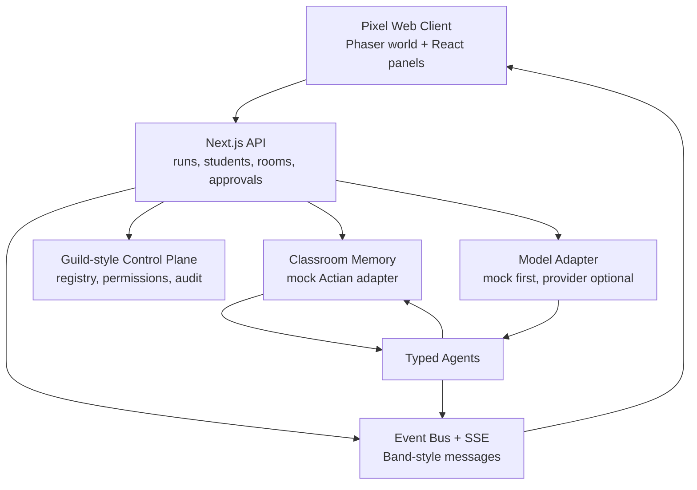
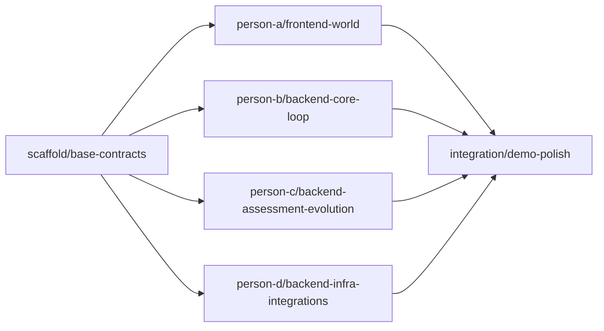

# SOTA Four-Person Build Plan

## North Star

EduForge should feel like a living classroom system, not an analytics dashboard. Judges should watch a school rebuild itself as agent events happen.

Three-minute demo path:

1. Professor uploads a multi-step equations assignment.
2. Concept icons appear: integer operations, distributive property, equation sequencing.
3. Agent mesh activates: Assignment Architect, Student Memory, Grouping, Accessibility, Curator.
4. Temporary rooms build: Ember, Forge, Harbor, Summit.
5. Students move into rooms based on current academic barriers.
6. Assignment morph view shows Original, Room Version, Student Layer.
7. Prepared submissions run.
8. Assessment finds misconceptions and confidence.
9. Mastery updates, students move, rooms resize.
10. Tomorrow plan appears with evidence links.

## Architecture



## Source Repository Roles

Use, do not blindly clone-and-pray:

- `twofactor/pogicity-demo`: frontend isometric rendering patterns, building placement, sprite movement. Replace restricted character assets.
- `agentailor/fullstack-langgraph-nextjs-agent`: API/SSE/human approval architecture reference.
- `RudrenduPaul/MasteryTrace`: BKT/IRT mastery update library or algorithm reference.
- `vercel/ai`: structured generation and model provider abstraction if needed.
- `openai/openai-agents-js`: simpler TypeScript agent orchestration if LangGraph is too heavy.

## SOTA Constraints

- Every agent output is structured and validated with Zod.
- Every backend event has a matching visible animation.
- Every grouping and adaptation has evidence.
- Group by learning barrier, never diagnosis or accommodation label.
- Accessibility is a delivery layer, not academic grouping logic.
- Low-confidence grades require professor review.
- Sponsor integrations live behind adapters and must have mock implementations.
- Demo mode must work offline except local dependencies.

## Shared Folder Ownership

| Folder | Owner | Notes |
| --- | --- | --- |
| `src/contracts` | Shared, frozen early | Only change through team agreement. |
| `src/seed` | Person B primary, Person C append-only | Synthetic students, assignment, submissions. |
| `src/world` | Person A | Phaser scene, animations, world state bridge. |
| `src/components` | Person A | React panels, controls, detail views. |
| `src/server/events` | Person D | Event bus, SSE, replay, log. |
| `src/server/adapters` | Person D | Guild/Band/Actian/Model/Replay adapters. |
| `src/server/agents` | Person B and C | Split by agent ownership below. |
| `src/server/mastery` | Person C | BKT/IRT/mastery update logic. |
| `src/app/api` | Person B/C/D by route | Route ownership listed in person docs. |

## Branch Dependencies

Parallel branches depend only on shared contracts:



## Branch Publish Commands

Run after scaffold lands on `main`:

```bash
git checkout main
git pull origin main
git checkout -b person-a/frontend-world
git push -u origin person-a/frontend-world

git checkout main
git pull origin main
git checkout -b person-b/backend-core-loop
git push -u origin person-b/backend-core-loop

git checkout main
git pull origin main
git checkout -b person-c/backend-assessment-evolution
git push -u origin person-c/backend-assessment-evolution

git checkout main
git pull origin main
git checkout -b person-d/backend-infra-integrations
git push -u origin person-d/backend-infra-integrations
```

## Acceptance Bar

A branch is merge-ready only when:

- `npm run lint` passes.
- `npm run typecheck` passes.
- `npm run build` passes.
- Branch-specific demo path works.
- Owner updated their person doc with completion notes.
- Owner did not edit another person's owned folders without a note.

Final demo is successful when:

- `POST /api/runs` starts the EduForge loop.
- `GET /api/runs/:runId/events` streams all required events.
- Pixel world animates rooms and students from real events.
- Simulated submissions update mastery and regrouping.
- Tomorrow lesson plan includes evidence.
- Entire flow runs from fixed seed in under three minutes.
